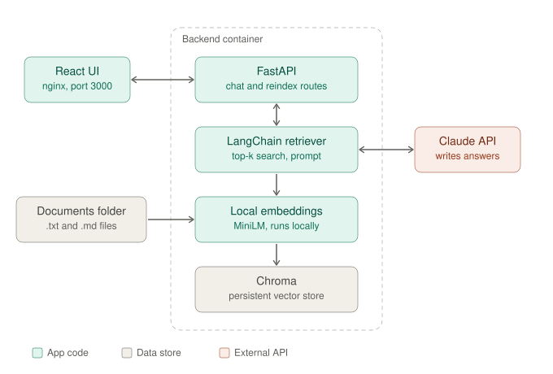
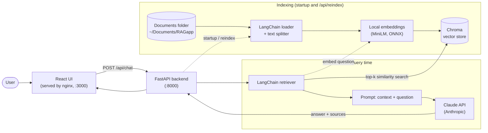

# lang_react_rag

Minimal RAG app: LangChain + Chroma + Claude, served by FastAPI, with a one-box React front end.

## Architecture





**Query flow:** the question goes from the browser through nginx to FastAPI. The question is embedded locally and Chroma returns the closest chunks. Those chunks and the question are sent to Claude, which answers from the retrieved context only. The answer and source file names return to the UI.

**Indexing flow:** on startup (and on `POST /api/reindex`) the backend reads `.txt` / `.md` files, splits them into chunks, embeds each chunk with the local model, and writes the vectors to Chroma.

Claude is used only for generation. Embeddings come from a separate local model, because Anthropic does not provide an embeddings endpoint.

## How it works

- On startup the backend reads every `.txt` / `.md` file under the documents folder, splits it into chunks, embeds it locally (Chroma's bundled MiniLM model), and stores it in Chroma.
- `POST /api/chat` retrieves the top matching chunks and asks Claude to answer from them only.
- `POST /api/reindex` rebuilds the index after you add or change files.

## Run with Docker

```bash
cp .env.example .env        # then set ANTHROPIC_API_KEY
docker compose up --build
```

Open http://localhost:3000. By default the app indexes `~/Documents/RAGapp`; set `DOCS_DIR_HOST` in `.env` to use another folder.

Reindex after changing documents:

```bash
curl -X POST http://localhost:8000/api/reindex
```

## Local development

```bash
# backend
cd backend
python -m venv .venv && source .venv/bin/activate
pip install -r requirements.txt
export ANTHROPIC_API_KEY=... DOCS_DIR=$HOME/Documents/RAGapp CHROMA_DIR=./chroma
uvicorn app.main:app --reload

# frontend (separate terminal)
cd frontend
npm install
npm run dev                 # http://localhost:5173, proxies /api to :8000
```

## Configuration

| Variable | Default |
| --- | --- |
| `ANTHROPIC_API_KEY` | required |
| `CLAUDE_MODEL` | `claude-sonnet-5-5` |
| `CHUNK_SIZE` / `CHUNK_OVERLAP` | `1000` / `150` |
| `TOP_K` | `4` |
